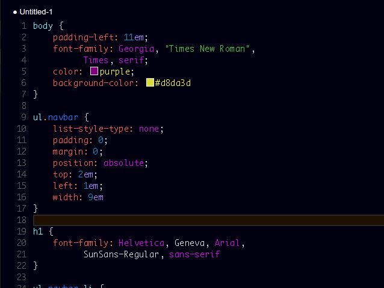
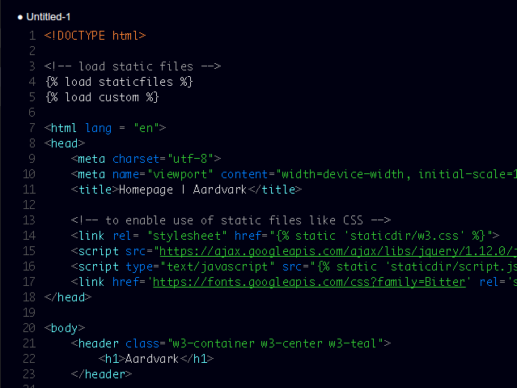
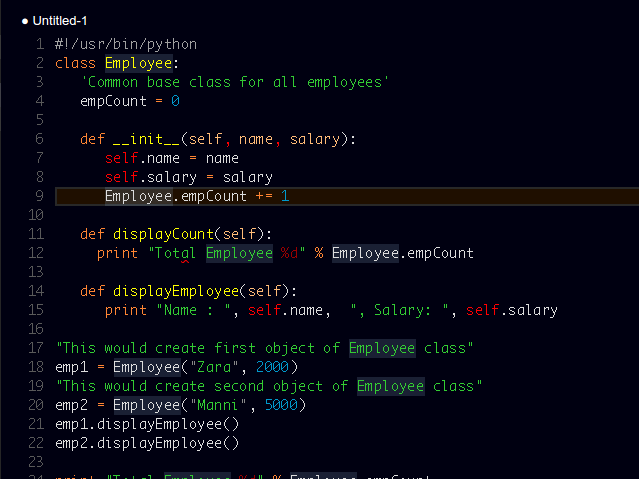

# Wildlife Theme

Wildlife is a dark vibrant color theme for vscode.

## How to install
Open vscode. Press `F1`, search "`ext install`" followed by extension name, in this case: "`ext install Wildlife Theme`" without the ">".
Or if you prefer ">**ext install**", hit enter, search "**Wildlife Theme**".

Still confused? Click "Get Started" above.

## Contributions

Feel free to contribute to the extension. Fork it on [github](https://github.com/tushortz/vscode-Wildlife-Theme)

## License

Read LICENSE on the [github](https://github.com/tushortz/vscode-Wildlife-Theme) repository

## Screenshot

--------------------------

------------------------

** Enjoy!**